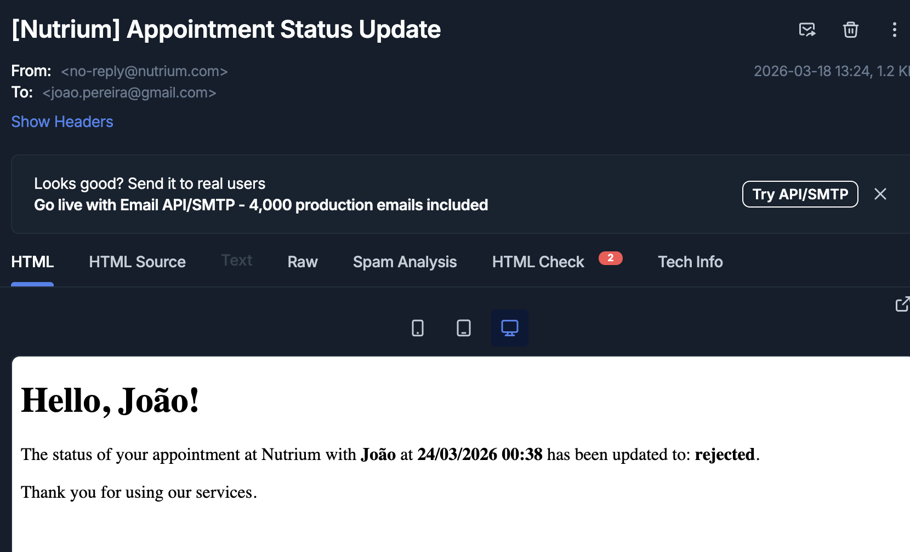

# README

* First run *bundle install*

* Change .env with your BACKEND_DATABASE_PASSWORD

* On config/environment/development.rb change to your smtp settings

  config.action_mailer.smtp_settings = {
    user_name: ***,
    password: **,
    address: **,
    host: **,
    port: '2525',
    authentication: :login
  }

* on config/database.yml
    The database is configured to development/my_database_dev and test/my_database_test feel free to change if you want

* Run *rails db:migrate* to create de database tables
    * district: masterfile table of portuguese districts prepared to translation
    * services: table of nutritionist's services, prepared to multiple services and types
    * guests: table of guests who can schedule an appointment
    * nutritionists: table of nutritionists 
    * catalogs: masterfile table of services associated with nutritionists and locations
      * the nutritionist can schedule the same service on diferent locations with diferent prices 
      * the nutritionist can schedule the same service on same location with different addresses
    * appointments: table of appointments with certain state and associated with a catalog
      * if some catalog fields changes for some reason this table remains intact
      * if the services prices or locatins changes it doesnt affect this table

* Run *rails db:seed* to populate the database

* Run *rails s* and server is listening on port 3000

* Run *rails test* to run some tests

* Example of email 

* POSTMAN collection shared at /test/nutrium.postman_collection.json if you want to test the APIs