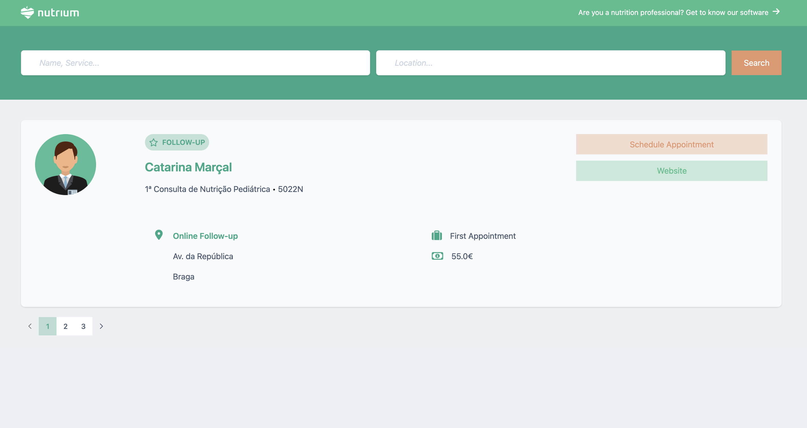
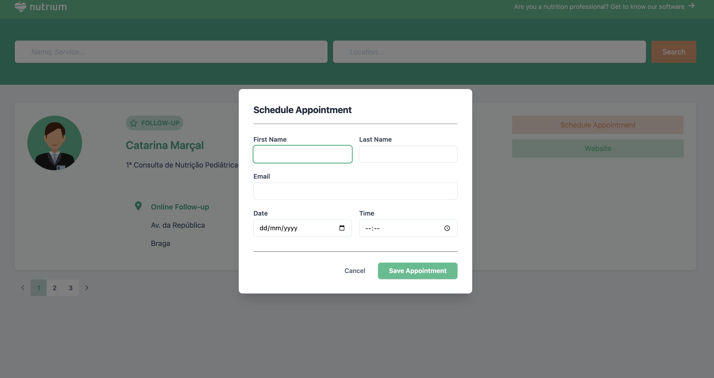
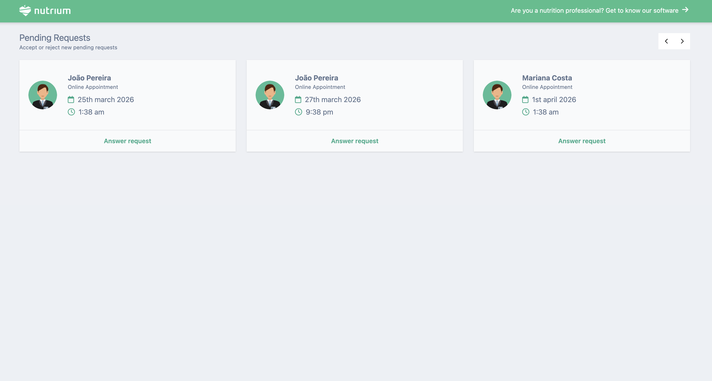

# React + Vite

* Run *npm install* for installing dependencies

* Run *npm run dev* to run this application on http://localhost:5173/

* The catalog page (guests view) is running on http://localhost:5173/

* The appointments page (nutritionist view) is running on http://localhost:5173/appointments

* You can test the translator i18n by running with http://localhost:5173/?lng=pt or http://localhost:5173/?lng=en 

* Notes: Pagination should be on backend - needs change

